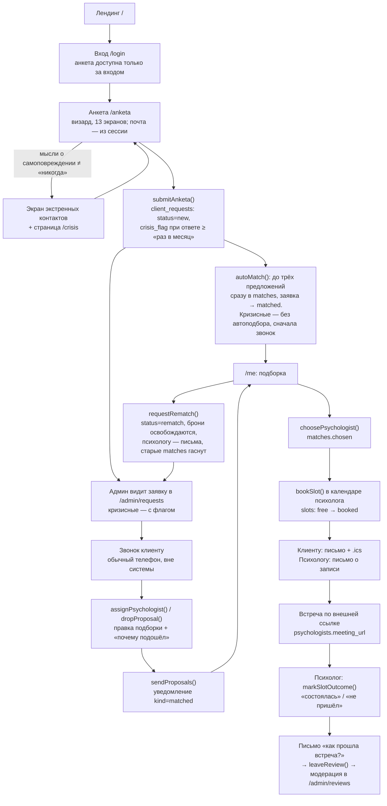
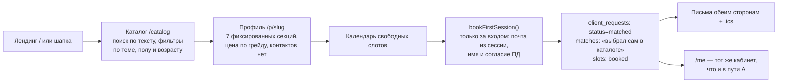
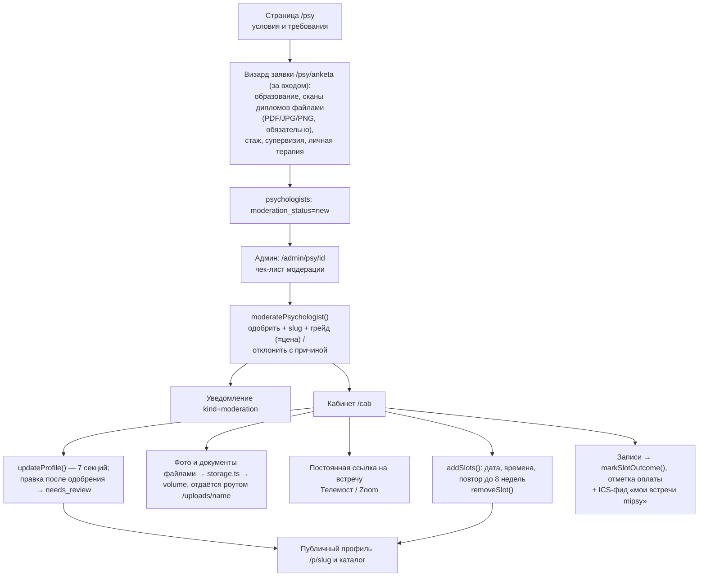
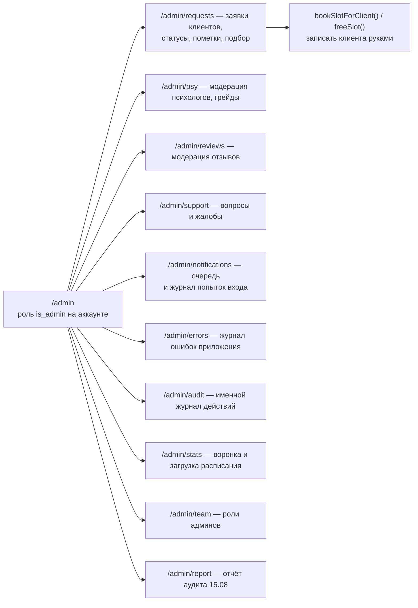
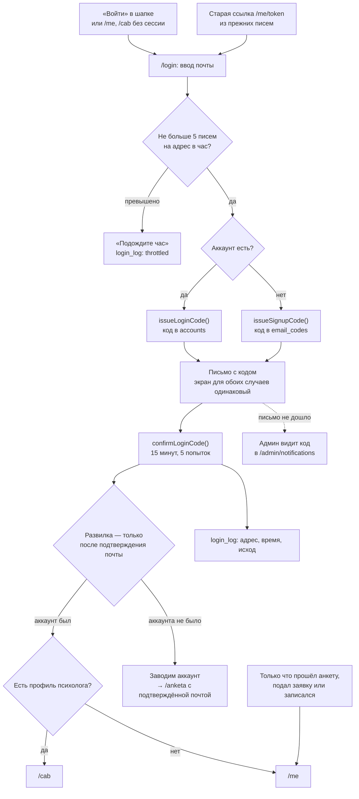

# Флоу mipsy и инструменты под ним

Карта того, как реально устроен продукт на 2026-08-15: кто и через какие страницы проходит, какое серверное действие срабатывает, что при этом пишется в базу и какой внешний инструмент подключается. Спек прототипа — `prototype.md`, сверка с ТЗ — `tz-checklist.md`, матрица функций — `funkcii-po-rolyam.md`, инфраструктура — `../deploy.md`.

## Роли и точки входа

| Роль | Вход | Что делает |
|---|---|---|
| Клиент | `/anketa`, `/catalog` или «Войти» → `/login` | Анкета или самостоятельный выбор в каталоге, дальше — личный кабинет `/me` |
| Психолог | `/psy` или «Войти» → `/login` | Заявка на модерацию, после одобрения — кабинет `/cab` |
| Админ | `/admin` (роль `accounts.is_admin`, вход по коду как у всех) | Заявки, модерация, подбор, отзывы, поддержка, очередь уведомлений, журналы, роли |
| Система | cron на VPS | Бэкап 04:00, healthcheck `/api/health` раз в 5 минут |

Клиентских путей два (референс SmartMental), оба сходятся в личном кабинете `/me`. Идентификатор — почта; аккаунт создаётся единственным способом — подтверждением кода на `/login`. Все формы с персональными данными (анкета, заявка психолога, запись из каталога) доступны только за входом и берут почту из сессии.

## 1. Клиент, путь А — подбор оператором

~~Первая встреча бесплатна по правилу платформы~~ **(отменено 14.08: бесплатных сеансов нет, все сессии платные).** Цену определяет грейд специалиста (1 базовый / 2 опытный / 3 ведущий — `lib/grades.ts`), назначается на модерации. Отмена и перенос ближе 24 часов — с удержанием стоимости сессии. Переподбор остаётся бесплатным и в один клик.

## 2. Клиент, путь Б — самостоятельный выбор

Фильтра по формату больше нет: все сессии — онлайн (решение 14.08).

Гонка за один и тот же слот исключена условным `UPDATE ... WHERE status='free'`; если слот успели занять, заявка откатывается. Покрыто автотестом на настоящей SQLite.

## 3. Психолог

Контакты психолога наружу не выводятся, в текстах профиля работает фильтр контактов — вся связь идёт через платформу.

## 4. Админ

Общий пароль оператора упразднён: админ — обычный аккаунт с ролью `accounts.is_admin`, вход по коду с почты, как у всех. Первого админа назначает переменная `ADMIN_EMAILS`, дальше роли раздаются на `/admin/team`. Старые адреса `/op/*` редиректят на `/admin/*`.

Каждое действие админа пишется в именной `admin_log` (`actor_account_id`) — требование по работе с данными о здоровье.

## 5. Вход в личный кабинет

Вход и регистрация — один шаг: код уходит и на знакомый адрес, и на незнакомый, поэтому по экрану нельзя понять, обращался человек к психологам или нет. Решение принимается после того, как он доказал, что почта его, — это стандартный sign-in-or-up (так устроены Supabase, Firebase и Clerk). Каждая попытка попадает в `login_log`, админ видит её в `/admin/notifications`.

Пароля нет намеренно: хранить нечего, и человеку в тяжёлом состоянии не надо ничего придумывать.

**Все формы с персональными данными — за входом.** Анкета, заявка психолога и запись из каталога требуют сессию, почту берут из неё и не доверяют полю из формы; аккаунт создаётся единственным способом — подтверждением кода на `/login`. У заявок, заведённых до аккаунтов, почту вписывает админ в карточке заявки.

## 6. Инструменты по слоям

| Слой | Чем сделано |
|---|---|
| Страницы и логика | Next.js 16 (App Router, серверные компоненты и server actions), React 19, TypeScript, Tailwind 4, shadcn/ui на Radix, иконки Tabler |
| Данные | SQLite через better-sqlite3 + Drizzle ORM; таблицы `accounts`, `topics`, `client_requests`, `psychologists`, `matches`, `slots`, `reviews`, `support_tickets`, `notifications`, `email_codes`, `login_log`, `error_log`, `admin_log` |
| Миграции | drizzle-kit генерирует SQL в `drizzle/`, `scripts/migrate.mjs` применяет их при старте контейнера и сидит справочник тем |
| Почта | nodemailer поверх SMTP (`SMTP_*`); приглашение — свой генератор `.ics` (`src/lib/ics.ts`) вложением к письму |
| SMS | smsc.ru через `SMS_LOGIN`/`SMS_PASSWORD`; код написан, ключи не подключены |
| Очередь уведомлений | Таблица `notifications`: канал выбирается автоматически (есть email и SMTP → письмо, иначе SMS), статус `pending`/`sent`/ошибка; неотправленное админ досылает руками из `/admin/notifications` |
| Видеовстреча | Своего модуля нет: психолог указывает постоянную комнату (Телемост, Zoom), ссылка попадает в бронь, письмо, `.ics` и кабинет клиента |
| Вход | `src/lib/auth.ts` и `auth-core.ts`: аккаунты по почте, шестизначные коды (`accounts` для знакомых адресов, `email_codes` для новых), HMAC-подпись сессии (`node:crypto`, секрет `SESSION_SECRET`), кука на 60 дней; админ — та же схема плюс роль `accounts.is_admin` |
| Файлы | `src/lib/storage.ts` → volume на VPS, раздача роутом `/uploads/[name]`; слой сменный под S3 |
| Хостинг | Docker на VPS 91.197.99.37, контейнер слушает только `127.0.0.1:8081`, снаружи — nginx + сертификат certbot: **https://mipsy.mskacademy.ru** |
| Эксплуатация | cron: ежедневный бэкап `VACUUM INTO` + gzip с ротацией 14 дней; healthcheck `/api/health` раз в 5 минут с письмом-алертом |
| Тесты | `node:test`, 67 проверок (`npm test`): жизненный цикл слота и гонки (включая параллельные перенос/отмену), автоподбор, генератор `.ics`, московское время и правило 24 часов, кризисный флаг, фильтр контактов, подпись сессии и коды входа, перенос базы на аккаунты — карта в `cabinets-audit.md` |

## 7. Этап → страница → действие → данные → внешний инструмент

| Этап | Страница | Серверное действие | Таблицы | Внешнее |
|---|---|---|---|---|
| Анкета | `/anketa` (за входом) | `submitAnketa` + `autoMatch` | `client_requests`, `matches` | — |
| Заявка психолога | `/psy/anketa` (за входом) | `submitPsyApplication` | `psychologists` + файлы дипломов | — |
| Подбор | `/admin/requests/[id]` | `assignPsychologist`, `dropProposal`, `sendProposals` | `matches`, `notifications` | Телефон админа, SMTP |
| Выбор специалиста | `/me` | `choosePsychologist` | `matches` | — |
| Запись | `/me`, `/p/[slug]` | `bookSlot`, `bookFirstSession`, `bookSlotForClient` | `slots`, `matches`, `notifications` | SMTP + `.ics` |
| Перенос / отмена | `/me` | `rescheduleSlot`, `cancelBooking` | `slots`, `notifications` | SMTP |
| Встреча | — | — | `slots.meeting_link` | Телемост / Zoom |
| Итог встречи | `/cab` | `markSlotOutcome` | `slots`, `notifications` | SMTP |
| Отзыв | `/me` → `/admin/reviews` | `leaveReview`, `moderateReview` | `reviews` | — |
| Переподбор | `/me` | `requestRematch` | `client_requests`, `matches`, `slots` | — |
| Поддержка и жалобы | `/me`, `/cab` | `createTicket`, `updateTicket` | `support_tickets` | — |
| Модерация психолога | `/admin/psy/[id]` | `moderatePsychologist` | `psychologists`, `notifications` | SMTP |
| Вход в кабинет | `/login` | `requestLoginCode`, `confirmLoginCode` | `accounts`, `email_codes`, `notifications`, `login_log` | SMTP |

## 8. Что в этой схеме делается руками и чего нет

- **Звонок клиенту** — обычный телефон админа, в системе живёт только статус заявки и пометка.
- **Напоминание за сутки** — текст готов (`messages.clientReminder`), планировщика нет, письмо не уходит.
- **Акцепта психолога нет** — клиент просто занимает свободный слот, отказаться от случая специалист не может.
- **Оплата** — напрямую специалисту, онлайн-оплаты нет. Психолог отмечает бронь «оплачена», клиент видит статус и получает письмо; при отмене/переносе ближе 24 часов действует правило удержания стоимости. Платёжной ссылки, сумм в системе и реестра выплат нет.
- **Событийная аналитика** — считается только состояние базы; переходы каталог → профиль → бронь не логируются, веб-аналитика не подключена.
- **Тестового окружения нет** — правки выкатываются сразу в прод одной ручной командой (`../deploy.md`).
- **Свой домен и почтовый ящик** — сейчас поддомен академии и адрес соседнего проекта; до платного трафика нужны свои, вместе с SPF/DKIM/DMARC.
- **Вход держится на письмах.** Без рабочего SMTP код не дойдёт и в кабинет не попасть; запасной канал (SMS через smsc.ru) написан, но провайдер не подключён. Пока страхует админ: код виден в `/admin/notifications` (страховка самого админа — `ADMIN_EMAILS` плюс код прямо в базе).
